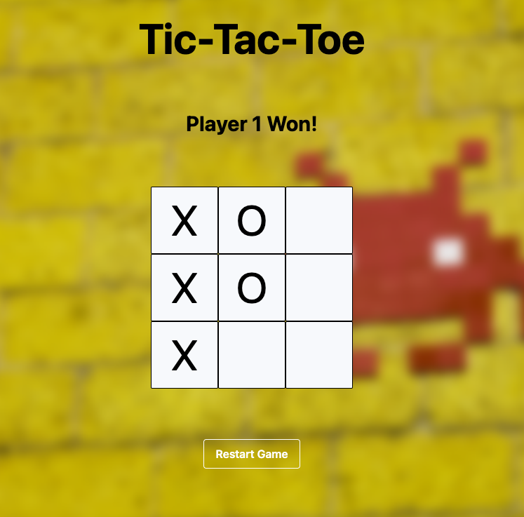

# Project: Tic-Tac-Toe
## Overview
The objective of this project is to learn modular design concepts in javascript by building an browser based Tic Tac Toe game.

## Preview

## Lesson Learned
- Spend at least 1 hour drafting requirement and writing a decent amount of pseudo code. It makes building so much easier.
- Spend at least 2 hours refactoring code before moving on to another project. In my previous projects I'd have spaghetti code and never put as much effort into refactoring as I did actually writing the code. 
- Run your own pentest to see what bugs you may not have considered. Don't just test happy path. This technique helped me discover a new type of bug related to eventListeners. This would not have been easy to catch by doing a security code review.
 

## Potential Improvements
- Allow for players to enter their name before they begin the game
- Use a modal for in-game error warnings instead of alert
- Convert to web3 by allowing array to be stored on-chain 
